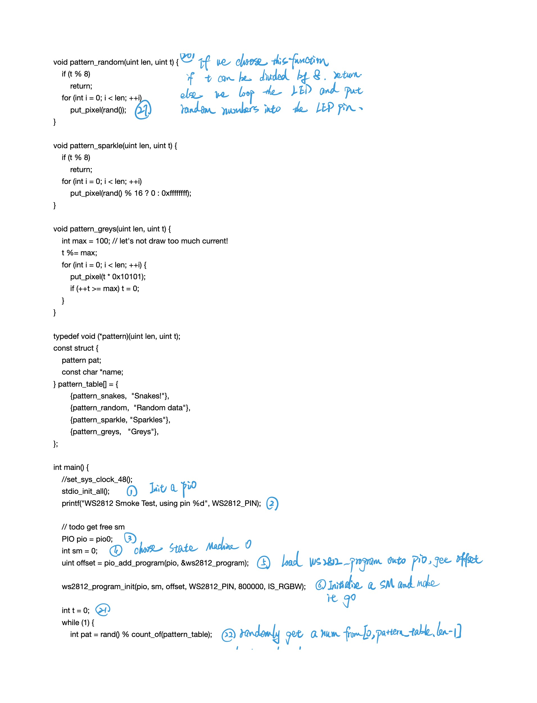

# Part 3 Tackling LEDs 

## 3.1 Resources 

Resource from Cornell

- https://ece4760.github.io/


## 3.2 PIO 

Read Chapter 3 in the Pico C SDK manual, and try to understand how the PIO module is used to communicate with a WS2812 module in the example. 

- Why is bit-banging impractical on your laptop, despite it having a much faster processor than RP2040?

  - The processor isn't really designed for this. It has a lot of tasks to handle with. 
  - When the speeds we need is near the processor's clock speed within some orders, IRQs becomes impractical because of the timing uncertainty of actually entering an interrupt handler and painstaking code written process.
  - The processor will be occupied by GPIO access and can't do any tasks during this process, which is undesirable. 

- What are some cases where directly using the GPIO might be a better choice than using the PIO hardware?

  - LEDs.
  - Button pushing. 

- How do you get data into PIO state machine?

  - From System: The data from the system go via AHB-lite Bus and through TX FIFO. Finally, it comes to the State Machine( the output shift register ).
  - From GPIO Input: The data from GPIO go through IO Mapping and to the State Machine (the input shift register).  

- How do you get data out of a PIO state machine?

  - To System: The data in the State Machine( the input shift register ) to the System go via RX FIFO and through AHB-lite Bus to access the System.
  - To GPIO: The datain the State Machine( the output shift register ) to the GPIO output go via IO Mapping to access the peripheral  and other hardware. 

- How do you program a PIO state machine?

  - Use PIO Assembly language
  - The state machine needs to be told which GPIO or GPIOs to output to. There are four different pin groups which are used by different instructions in different situations. 
  - The GPIO also needs to be told that PIO is in control of it.
  - Make sure the PIO is driving the output enable line high if you want to use the pin for output only. 

- In this example, which low-level C SDK function is directly responsible for telling the PIO to set the LED to a new color? How is this function accessed from the main "application" code?

  - `pio_sm_put_blocking`. It is accessed from the `pio.h` header.

- What role does the pioasm "assembler" play in the example, and how does this interact with CMake?

  - It translates the `.pio` program into a binary program. Interacted by `pico_generate_extra_output()`, which gives us extra files like `.uf2`, `.hex` and so on. 

  

## 3.3. Follow the flow

Step through the `ws2812.c` and `ws2812.pio.h`

### Work flow of `ws2812.c`





### Work flow of `ws2812.pio.h`


## 3.4. Color by number 

In this example, I pick 0x00ff00 (in RGB), which is 0xff0000 in GRB.

Right now we need to write down the address, value, offset, name of these registers and the excel spreadsheet is [Here](./part3.xlsx).


Here are a few questions you could answer to get started:

* Which PIO instance is being used?

  * `pio0` based on the `ws2812.c` file.

  * ```c
    // todo get free sm
    PIO pio = pio0;
    int sm = 0;
    uint offset = pio_add_program(pio, &ws2812_program);
    ```

- Which state machine is being used with this PIO instance?
  - State Machine 0 based on the `ws2812.c` file. 
- Which pin is this state machine configured to control? (you can either use settings from the example program, or for the Qt Py LED pin yours will be connected to)
  - `WS2812_PIN`, which is `12` based on `ws2812.h` file
- How long is this state machine's clock cycle?
  - The frequency is 800000


## 3.5. Modeling Time

After we get a detailed snapshot of the SM's state, we could step through the SM's operation to think about the detailed operation process. 

Here is something about WS2812:

1. WS2812 uses non-return-to-zero encoding to represent '0' and '1'.
2. WS2812 uses "GBR" chennel in order rather than typical "RGB" channel. 
3. WS2812 uses wired connection to link between DI in WS2812 with PIN 12 in RP2040. 
4. WS2812 uses DI-DO serial connection when we need several WS2812s. 


```assembly
bitloop:
    ; 1. [T3 - 1] is the number of delay circles. The instruction itself takes a circle.
    ; 2. "x" and "y" are two scratch registers. State machines use their scratch registers
    ;     to compare temp data.  
    ; 3. "out" takes some bits from the output shift register(OSR) to "x".
    ; 4. "side 0": drive low(0) the pin configured for side-set. 
    ; workflow: first set "set-side" = 0, then move one bit from OSR to x, finally wait[T3 - 1] circles.
    ;
    out x, 1       side 0 [T3 - 1] ; Side-set still takes place when instruction stalls
    
    ; 1. "side 1": drive high the pin configured for side-set
    ; 2. "jmp": jump to do_zero if !x == true 
    ; 3. [T1 - 1]: the whole circle is T1. 
    jmp !x do_zero side 1 [T1 - 1] ; Branch on the bit we shifted out. Positive pulse
do_one:
    jmp  bitloop   side 1 [T2 - 1] ; Continue driving high, for a long pulse
do_zero:
    ; nop: Do nothing 
    nop            side 0 [T2 - 1] ; Or drive low, for a short pulse
.wrap
```

```assembly
bitloop:
    out x, 1       side 0 [T3 - 1] ; L1
    jmp !x do_zero side 1 [T1 - 1] ; L2
do_one:
    jmp  bitloop   side 1 [T2 - 1] ; L3
do_zero:
    nop            side 0 [T2 - 1] ; L4
.wrap
```


The whole time diagram depicts the process between Data loaded in FIFO and the finished transmision of first bit.  

Here is something imporatnt you need to know:

1. The whole process is as follows:

   - Data comes to FIFO -> OSR pulls data -> right shift to GPIO Pin -> WS2812 gets data bit 

2. $T_1, T_2, T_3$ represents the different time period spent by each setted instruction.

   - Actually, each instruction costs one SM circle. 

   - To allign your whole period so as to fit the protocol, we add some delay period.

3. Tthe SM stalls when FIFO is empty and OSR still use pull, which causes a 'freeze' of the state. 

4.  '0' and '1' are represented by the different time period of high level voltage.


## 3.6 & 3.7 Zooming in & Time Diagram


After we finish the transmision in a bit, we start to tranmit the whole package. 

In this section, we are trying to find out the causal relationship between different signals. 

In this case, it is:

1. SM clock signal
2. SM cycle count
3. GPIO output pin voltage
4. WS2812 serial input pin voltage
5. WS2812 LED supply voltage
6. WS2812 LED luminance
7. Fictitious APDS-9960 photodiode voltage


Before we draw the picture, we know that:

- The SM clock and SM cycle count is independent to other signals. 
- GPIO output is drived by output of OSR.
- WS2812 serial input pin is drived by GPIO output pin.
- WS2812 LED supply voltage is independent to other signals.
- WS2812 LED luminance only exists when the LED is on, which means that the WS2812 LED receives the whole color data. 
- APDS-9960 can only detect luminance after the WS2812 LED is on. 


Now we can draw the picture:


After we know the transmision for a bit, we can draw the transmission for a data packge. 


[Here](./part3.xlsx) is the complete spreadsheet about the different value in registers and different voltage in pins.


## 3.8 Hello Blinkenlight

In this section, we write a C program to make RP2040 interative. 

Here is the main function and logic:

- Function: 
  - When pressing 'r', 'g', and 'b', WS2812 emits the corresponding 'red', 'green', and 'blue' light.
- Logic:
  - Set up the WS2812 Power pin to high.
  - Initialize the WS2812 program, including PIO program, SM and GPIO.
  - Use `getchar` to receive the input from keyboard.
  - Set corresponding color data into PIO. 

Here is the Demo:

